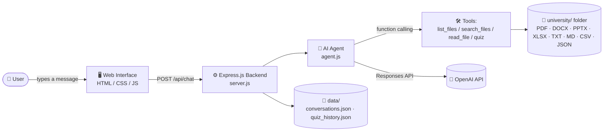

<div align="center">

# 🎓 AI Study Agent

**An AI-powered study assistant that reads your university files and helps you learn from them.**


</div>

---

## 📖 About

**AI Study Agent** is a web app that lets a university student chat with an AI agent about their own study materials. You drop your PDFs, Word docs, slides, and spreadsheets into a local folder (or upload them from the browser), and the agent can search, read, and explain them, or turn them into a 5-question quiz.

The AI agent doesn't just generate answers freely — it works through a set of tools (list files, search files, read a file, run a quiz) and only touches the folder in **read-only** mode. It never creates, edits, deletes, or executes anything inside your study materials.

📸 Screenshot placeholder — 


## ✨ Features

| | Feature | Description |
|---|---|---|
| 🤖 | **AI study assistant** | Chat with an agent that answers questions and explains topics using your own files |
| 🔎 | **File search** | Recursively search the `university` folder by file name |
| 📂 | **Multi-format file reading** | Reads `.pdf`, `.docx`, `.pptx`, `.xlsx` / `.xls`, `.txt`, `.md`, `.csv`, and `.json` |
| 🧠 | **Interactive quizzes** | Generates a 5-question multiple-choice quiz on a topic, checks each answer, explains it, and gives a final score |
| 💬 | **Conversation history** | Conversations are saved on the server and can be reopened or deleted from the sidebar |
| 📊 | **Student dashboard** | A quick summary of files available, conversations, messages sent, and quizzes completed |
| 📁 | **In-browser upload** | Upload a study file directly from the web UI; it's saved into the university folder |
| 🖥️ | **Simple web UI** | A clean, Arabic-language (RTL) single-page interface — sidebar, chat, dashboard and upload modals |
| ⌨️ | **CLI mode** | The agent can also be run and chatted with directly from the terminal (`node agent.js`) |

---

## 🧩 Architecture

The agent doesn't call the OpenAI API directly to answer — it runs a **tool-calling loop**: the model decides which tool to call (list files, search, read a file, run quiz logic), the server executes it against the local file system, and the result is fed back to the model until it has a final answer.



**How a chat message flows:**
1. The browser sends the message (plus recent history) to `POST /api/chat`.
2. `agent.js` sends it to the OpenAI Responses API along with the available tools.
3. If the model wants to look something up, it calls a tool (e.g. `search_files`, `read_file`) — the server runs it locally and returns the result to the model.
4. This repeats until the model returns a final text answer, which is sent back to the browser and appended to the conversation file on disk.

---

## 🗂️ Project Structure

```
study-agent/
├── server.js         # Express server: API routes, conversations, dashboard, upload
├── agent.js          # AI agent: OpenAI tool-calling loop, file readers, quiz logic
├── index.html         # Main page markup (sidebar, chat, dashboard & upload modals)
├── app.js             # Front-end logic: chat, sidebar, dashboard, upload
├── style.css          # Styling for the interface
├── university/         # (created at runtime) your study files live here
│   └── uploads/         # files uploaded from the web UI land here
├── data/               # (created at runtime) local persisted data
│   ├── conversations.json
│   └── quiz_history.json
└── .env                # OPENAI_API_KEY (not committed)
```

> **Note:** `server.js` serves static assets from a `public/` folder (`express.static(path.join(__dirname, "public"))`). If you're running the project as-is, make sure `index.html`, `app.js`, and `style.css` are placed inside a `public/` directory next to `server.js` (or update that line if you'd rather serve them from the project root).
>
> The `university/` and `data/` folders are created automatically the first time the server runs — you don't need to create them by hand.

---

## 🚀 Getting Started

### Prerequisites

- [Node.js](https://nodejs.org/) (v18 or later recommended)
- An [OpenAI API key](https://platform.openai.com/api-keys)

### Installation

> This project doesn't currently include a `package.json`. Based on the packages actually imported in the code, you'll need the following:

```bash
git clone https://github.com/your-username/ai-study-agent.git
cd ai-study-agent

npm init -y
npm install express dotenv openai pdf-parse mammoth pptx-text-parser xlsx
```

*(Consider committing a `package.json` with these as dependencies and a `"start": "node server.js"` script so future installs are just `npm install && npm start`.)*

### Environment Variables

Create a `.env` file in the project root:

```env
OPENAI_API_KEY=your_openai_api_key_here
```

> The server itself runs on a fixed port (`3000`, set directly in `server.js`) — there's no `PORT` environment variable in the current code.

### Running the app

```bash
node server.js
```

Then open **http://localhost:3000** in your browser.

You can also chat with the agent directly from the terminal, without the web UI:

```bash
node agent.js
```

---

## 🖱️ Usage

1. **Add study materials** — drop PDF/DOCX/PPTX/XLSX/TXT/MD/CSV/JSON files into the `university/` folder, or use the **📁 Upload** button in the sidebar.
2. **Ask a question** — type something like *"Summarize the requirements engineering project"* and the agent will search and read the relevant file(s) before answering.
3. **Take a quiz** — ask for a quiz on a topic; the agent generates 5 multiple-choice questions from your material, one at a time, and gives you your score at the end.
4. **Check your dashboard** — open **📊 Student Dashboard** to see how many files, conversations, messages, and quizzes you've racked up.
5. **Revisit conversations** — previous chats are listed in the sidebar and can be reopened or deleted.

<details>
<summary>💬 <strong>Example: asking about a file</strong></summary>

```
You: Summarize the requirements engineering project for me

Agent: [searches the university folder, reads the matching file]
        Here's a summary of your requirements engineering project...
```

</details>

<details>
<summary>🧠 <strong>Example: a quiz session</strong></summary>

```
You: Make me a 5-question quiz about requirements engineering

Agent: Question 1 of 5:
       What is the main goal of requirements elicitation?
       A) ...  B) ...  C) ...  D) ...

You: B

Agent: ✅ Correct! [short explanation]
       Question 2 of 5: ...
```

At the end of the 5 questions, the agent reports your score (e.g. *4/5*) and the result is saved to your quiz history.

</details>

---

## 🧠 How the AI Agent Works

The agent is built around **OpenAI's Responses API with function calling**. It's given a fixed set of tools and instructed to use them instead of guessing:

| Tool | What it does |
|---|---|
| `list_files` | Lists files/folders inside `university/` |
| `search_files` | Recursively searches file names inside `university/` |
| `read_file` | Reads and extracts text from a specific file |
| `start_quiz` | Starts a new 5-question quiz session for a topic |
| `save_quiz` | Saves the 5 generated questions for the active quiz |
| `get_current_question` | Returns the current quiz question |
| `answer_quiz` | Checks the student's answer, scores it, and advances the quiz |

A safety check (`getSafePath`) resolves every file path against the `university/` folder and rejects anything that tries to escape it, so the agent can only ever read files that live inside that folder.

### Supported file formats

| Format | Library used |
|---|---|
| PDF (`.pdf`) | `pdf-parse` |
| Word (`.docx`) | `mammoth` |
| PowerPoint (`.pptx`) | `pptx-text-parser` |
| Excel (`.xlsx`, `.xls`) | `xlsx` |
| Plain text / Markdown / CSV / JSON | native `fs.readFileSync` |

---

## 🛠️ Technologies

- **Backend:** Node.js, Express.js
- **AI:** OpenAI API (Responses API, function calling)
- **File parsing:** `pdf-parse`, `mammoth`, `pptx-text-parser`, `xlsx`
- **Frontend:** HTML, CSS, vanilla JavaScript (no framework)
- **Storage:** Local JSON files on the server (`data/conversations.json`, `data/quiz_history.json`); the browser only uses `localStorage` to remember which conversation is currently open
- **Version control:** Git & GitHub

---

## 🚧 Future Improvements

- [ ] Add a real `package.json` with pinned dependency versions and npm scripts
- [ ] Full-text search inside files (currently search matches on file **names**, not file contents)
- [ ] User authentication, so conversations aren't shared across everyone using the server
- [ ] A proper database instead of flat JSON files for conversations/quiz history
- [ ] English/multilingual UI (currently Arabic-only, right-to-left)
- [ ] Automated tests for the agent's tool-calling logic

---

## 📌 Project Status

This is a **student-built prototype** created as a portfolio/learning project. It works end-to-end for the core flows (chat, file reading, quizzes, dashboard, upload) but hasn't been hardened for production use — there's no authentication, and it's meant to be run locally by a single user.

---


<div align="center">

Made as a university portfolio project 🎓

</div>
